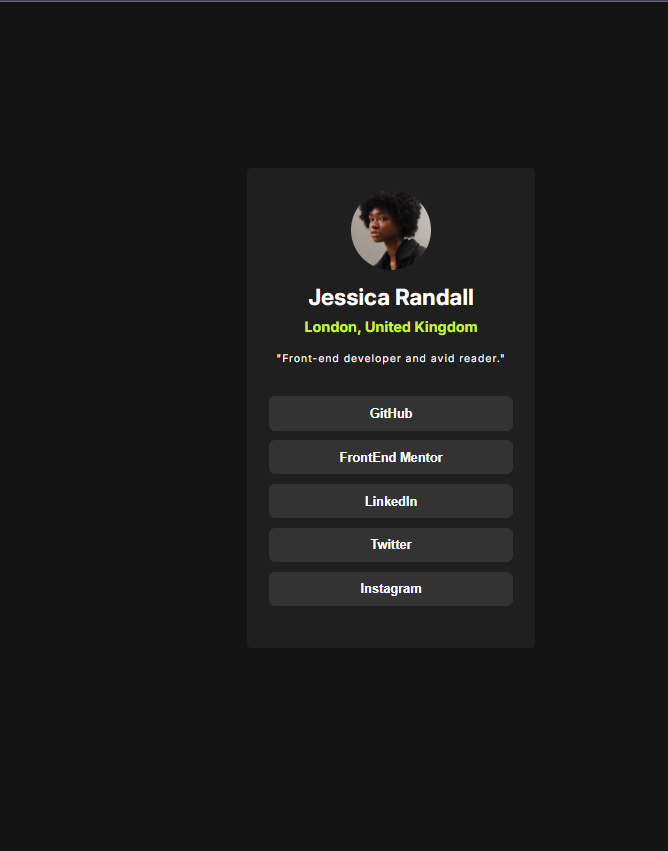

# Frontend Mentor - Social links profile solution

This is a solution to the [Social links profile challenge on Frontend Mentor](https://www.frontendmentor.io/challenges/social-links-profile-UG32l9m6dQ). Frontend Mentor challenges help you improve your coding skills by building realistic projects.

## Table of contents

- [Overview](#overview)
  - [The challenge](#the-challenge)
  - [Screenshot](#screenshot)
  - [Links](#links)
- [My process](#my-process)
  - [Built with](#built-with)
  - [What I learned](#what-i-learned)
  - [Continued development](#continued-development)
  - [Useful resources](#useful-resources)
- [Author](#author)
- [Acknowledgments](#acknowledgments)

## Overview

### The challenge

Users should be able to:

- See hover and focus states for all interactive elements on the page

### Screenshot



### Links

- Solution URL: [Live](https://social-link-profile-challenege.netlify.app/)
- Live Site URL: [repo](https://github.com/farazalam2017/social-link-profile-frontendMentor-challenge-)

## My process

### Built with

- Semantic HTML5 markup
- CSS custom properties
- Flexbox
- Mobile-first workflow

### What I learned

The things which i learn are follwing :-

- apply flexbox property properly to parent element and try to observe changes in the child component
- It is better to write 2 lines of test code before actually implementing the code
- using min-width and max-width allow user to not to break the UI during the responsiveness
- It's ok to see other code for learning.
  To see how you can add code snippets, see below:
- Until and Unless you are not good at CSS at least fundamental you can be good at CSS based framework like bootstrap, tailwind etc.

```css
.proud-of-this-css {
  body {
    font-family: "Inter", sans-serif;
    background-color: var(--grey-900);
    color: var(--white);
    display: flex;
    justify-content: center;
    align-items: center;
    flex-direction: column;
    min-height: 100vh;
    padding: 1.8rem 3rem;
  }
}
```

### Continued development

I am still struggling to identify what css to apply to make things work like the final demo UI, but my thought process is changing in terms styling things using CSS.

### Useful resources

- [Google](https://www.google.com)

## Author

- Website - [Faraz Alam](https://personal-portfolio-farazalam.vercel.app/)
- Frontend Mentor - [farazalam2017](https://www.frontendmentor.io/profile/farazalam2017)

## Acknowledgments

First and foremost, I thank Allah, who has blessed me with a good life, wonderful parents, and a supportive environment to learn and grow through all the ups and downs of life. Remember, all of us are destined to leave this world one day. Before that day comes, strive to do something meaningful — something that makes those who remain proud and benefits humanity. Let the tree you plant bear sweet fruits for others, and may you be remembered with a smiling face in the hereafter. A special thanks to the person who created such a wonderful platform for helping us practice and improve ourselves.
